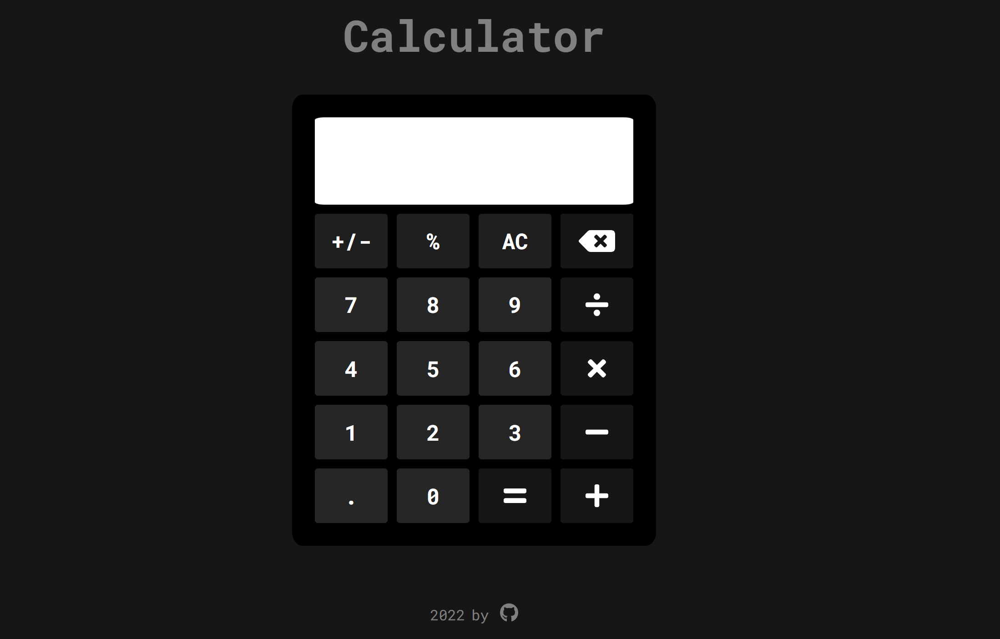

# calculator

Live preview: https://bgtti.github.io/calculator/

Part of the Odin Project "Calculator"

This calculator can do simple mathematical operations: addition, subtraction, multiplication, division.
It evaluates two numbers at a time and rounds the result to 5 decimal points.

This simple calculator is built using HTML, CSS, and vanilla JavaScript.
All calculator functions are inside of a calculator object, and event listeners are used to access the calculator methods.

Link to the Odin Project guidelines: https://www.theodinproject.com/paths/foundations/courses/foundations/lessons/calculator
